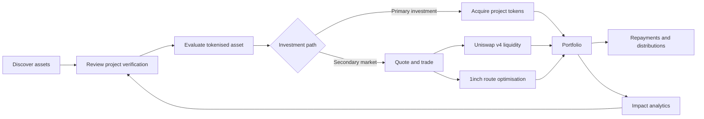
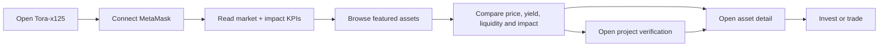
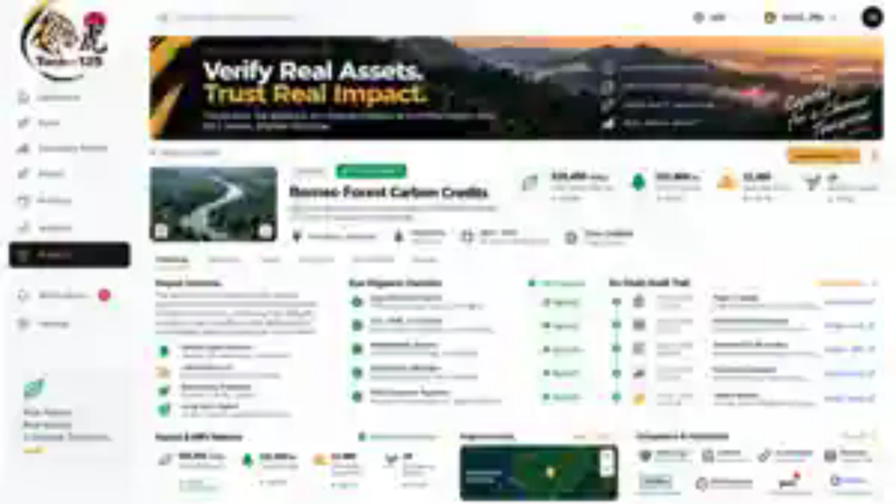
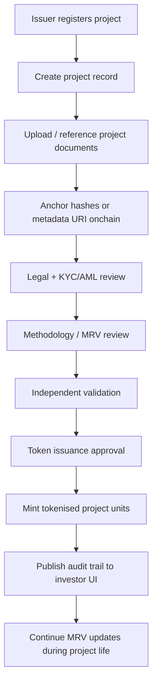
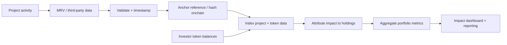
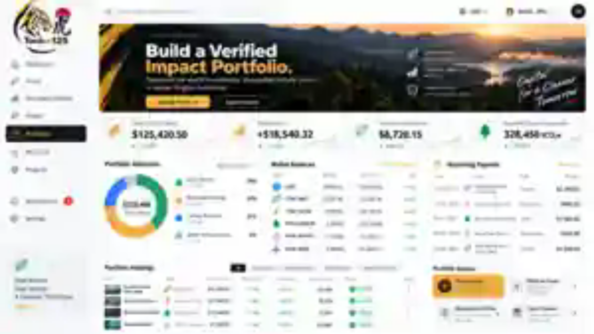
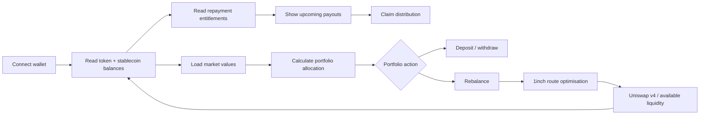
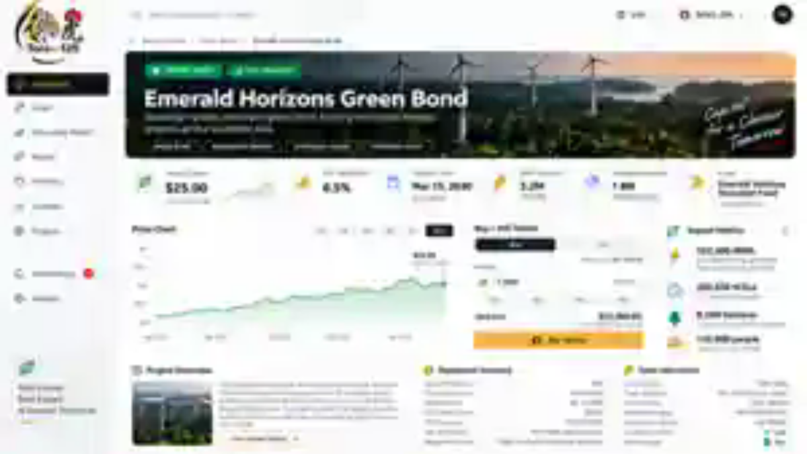
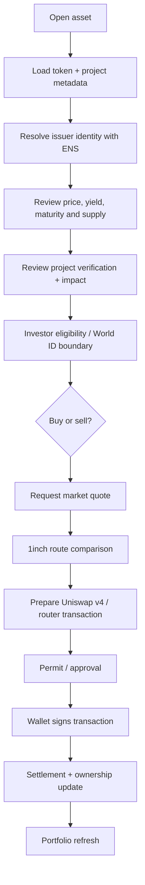

<p align="center">
  
</p>

# Tora-x125

**A secondary market for verified, tokenised impact investments.**

Tora-x125 is built around tokenised impact assets and programmable secondary liquidity. We use smart contracts to fractionalise green investments into tradable tokens, with project, financial and impact data linked onchain. Uniswap v4 provides liquidity pools and hooks for dynamic trading logic, while 1inch optimises swap routing and stablecoin settlement. ENS gives projects and issuers readable identities, and World ID supports privacy-preserving investor verification.

The core implementation targets **Ethereum and Base**. We also explored a **Sui** implementation using Move, zkLogin and DeepBook as an alternative high-performance secondary-market architecture.

## Hackathon stack

### Ethereum developer tools

- Solidity
- OpenZeppelin
- Uniswap v4
- ethers.js / viem-compatible EVM interfaces
- MetaMask / EIP-1193 wallets
- Ethereum testnets

### Blockchain networks

- Ethereum
- Base

### Programming languages

- Solidity
- TypeScript
- JavaScript

## Architecture

```text
Investor / issuer
      |
      +---- MetaMask / EIP-1193 wallet
      |
      +---- World ID
      |       privacy-preserving investor verification
      |
      v
Next.js / TypeScript dashboard
      |
      +---- ENS
      |       readable issuer and project identities
      |
      +---- Project, financial and impact data
      |       linked to tokenised assets onchain
      |
      v
Ethereum / Base smart contracts
      |
      +---- ImpactAsset1155
      |       fractional project units
      |
      +---- ImpactToken
      |       demo ERC-20 settlement asset
      |
      +---- RepaymentVault
      |       programmable project distributions
      |
      +---- Uniswap v4
      |       liquidity pools + programmable hooks
      |
      +---- 1inch
              route optimisation + stablecoin settlement
```

## What is included

- Next.js + TypeScript investor dashboard
- EIP-1193 / MetaMask wallet connection using ethers.js
- ERC-1155 project-unit tokenisation
- ERC-20 demo settlement/liquidity token
- Repayment vault for project distributions
- Uniswap v4 / Universal Router execution helper
- 1inch routing integration adapter
- ENS name-resolution helper
- World ID integration configuration boundary
- Ethereum Sepolia and Base Sepolia deployment configuration
- Hardhat contract tests and GitHub Actions CI
- Documentation of the explored Sui / Move / zkLogin / DeepBook architecture

## Product use cases

The six product views below describe an end-to-end investor journey for verified, tokenised impact investments. Together they show how Tora-x125 connects **project verification**, **tokenisation**, **secondary liquidity**, **portfolio management**, and **measurable impact** in one product experience.

### End-to-end workflow



The intended demo journey is **Dashboard → Project Verification → Asset Detail → Secondary Market → Portfolio → Impact Analytics**. The screens use illustrative hackathon data; production deployments would replace that data with indexed onchain state, verified MRV feeds, market APIs, authenticated investor information, and production transaction execution.

---

### 1. Investor dashboard — `/`

<p align="center">
  
</p>

**Primary user:** Investor, portfolio manager, impact fund, family office, or institutional allocator.

**Goal:** Give the investor a fast overview of the available market before they decide what to investigate or trade. The dashboard combines financial activity with verified impact rather than treating sustainability data as a separate report.

**What the screen demonstrates**

- Market-level KPIs: total tokenised assets, 24-hour trading volume, verified impact and active investors.
- Featured assets across green bonds, renewable-energy projects and carbon-removal assets.
- Current token prices, market movement and liquidity indicators.
- Recent buy/listing activity.
- Impact highlights such as verified CO₂e and protected habitat.
- A persistent wallet connection and navigation into project verification, asset details, portfolio and secondary-market views.

**Investor workflow**



**Technology / data flow**

```text
MetaMask / EIP-1193
        |
        v
Next.js dashboard
        |
        +--> ethers.js / viem-compatible EVM reads
        +--> Ethereum / Base token balances and events
        +--> ENS-readable issuer/project identities
        +--> Indexed price / liquidity data
        +--> Verified MRV / impact data
```

The current dashboard uses demo data from the frontend data layer. In a production version, headline values and recent activity would be derived from contract events, an indexer, liquidity sources and approved project-data feeds.

---

### 2. Project verification — `/projects`

<p align="center">
  
</p>

**Primary user:** Investor or due-diligence analyst evaluating whether the underlying real-world project is credible before allocating capital.

**Goal:** Make the provenance of an impact asset visible. The investor should be able to understand what was reviewed, who validated it, what impact methodology is being used, and which records have been anchored onchain.

**What the screen demonstrates**

- Project description, location, project category and token identity.
- Due-diligence checklist covering legal structure, KYC/AML, methodology review, third-party validation and token issuance approval.
- Onchain audit trail for project creation, document anchoring, audit verification, impact-data updates and token minting.
- MRV metrics such as carbon removed, forest protected, households supported and biodiversity indicators.
- Verification and compliance status.
- Links between real-world project evidence and token issuance.

**Verification workflow**



**Onchain and partner touchpoints**

- **Solidity + OpenZeppelin:** project-token and access-control logic.
- **ImpactAsset1155:** fractional project units linked to project metadata.
- **ENS:** human-readable identity for issuers and projects.
- **World ID:** privacy-preserving investor verification boundary where an eligibility proof is appropriate.
- **External validators / MRV providers:** provide signed or auditable evidence; only references/hashes need to be anchored onchain.
- **Ethereum / Base:** immutable event and metadata-reference layer.

This flow intentionally separates **verification evidence** from **financial ownership**. The token points to an auditable project record; it does not by itself prove that an impact claim is valid.

---

### 3. Impact analytics — `/impact`

<p align="center">
  
</p>

**Primary user:** Investor, ESG/impact team, fund manager, issuer, or reporting stakeholder.

**Goal:** Show financial performance and real-world outcomes in the same portfolio view, so an investor can answer both “How is my investment performing?” and “What measurable impact is associated with my holdings?”

**What the screen demonstrates**

- Portfolio value and aggregate verified impact.
- Renewable-energy capacity, households powered and habitat protected.
- Portfolio allocation by impact-asset type.
- Impact-over-time visualisation.
- Asset-level impact attribution.
- Geographic coverage across projects and countries.
- Verification/compliance status for reported impact.

**Impact-data workflow**



**Example metrics**

| Category | Example display | Data concept |
| --- | --- | --- |
| Carbon | 328,450 tCO₂e | Avoided or removed emissions |
| Renewable energy | 85.4 MW | Installed / attributable capacity |
| Social | 142,300 households | Beneficiary or access metric |
| Nature | 8,240 ha | Habitat or forest protected |

In production, Tora-x125 would preserve the source, methodology, reporting period and verification status for each metric so that portfolio aggregation does not erase the underlying evidence.

---

### 4. Portfolio management — `/portfolio`

<p align="center">
  
</p>

**Primary user:** Token holder managing several impact assets and stablecoin balances.

**Goal:** Provide one place to understand positions, returns, cash flows and impact exposure after the investor has acquired tokenised assets.

**What the screen demonstrates**

- Total portfolio value, return, yield earned and real-world impact generated.
- Allocation across green bonds, renewable energy, carbon removal and infrastructure.
- Wallet balances for USDC and project tokens.
- Upcoming coupons, yields and project distributions.
- Verified portfolio holdings.
- Deposit, withdrawal, rebalancing and reward/repayment actions.

**Portfolio workflow**



**Smart-contract mapping**

- **ImpactAsset1155:** investor project-unit balances.
- **ImpactToken / stablecoin settlement:** quote-side and settlement assets for the MVP.
- **RepaymentVault:** programmable distributions based on token holdings.
- **Ethereum / Base explorer links:** transaction and token-history traceability.
- **1inch:** intended route optimisation for portfolio rebalancing.
- **Uniswap v4:** intended programmable liquidity for supported market pairs.

A production distribution model should use appropriate record-date/snapshot mechanics rather than assuming the current token balance always represents historical entitlement.

---

### 5. Tokenised asset detail — `/assets/emerald-horizons`

<p align="center">
  
</p>

**Primary user:** Investor making a decision on a specific tokenised impact investment.

**Goal:** Bring the information needed to assess and transact in a single asset into one page: financial terms, token supply, issuer identity, project impact, verification status, repayment logic and market access.

**What the screen demonstrates**

- Token price, estimated yield, maturity, total issuance and remaining supply.
- Issuer and project classification.
- Asset price history.
- Buy/sell interaction.
- Renewable-energy, carbon, nature and social impact metrics.
- Project overview and use of proceeds.
- Coupon / repayment terms.
- Token standard, market status and investor-verification requirement.

**Asset-investment workflow**



**Implementation boundary**

The current page demonstrates the interaction and data model. Production execution still requires live pool configuration, Permit2/approval handling, Uniswap v4 command encoding, authenticated 1inch access where used, and appropriate investor/transfer restrictions.

For market liquidity, ERC-1155 project units may require a defined fungible representation or wrapper depending on the chosen pool design.

---

### 6. Secondary market — `/market`

<p align="center">
  
</p>

**Primary user:** Investor seeking liquidity before an impact investment reaches maturity.

**Goal:** Turn normally illiquid green investments into discoverable, priceable and tradable digital assets while keeping the underlying project and impact information attached to the investment experience.

**What the screen demonstrates**

- Multi-asset ticker for green bonds, solar projects, carbon credits, water infrastructure and wind assets.
- Market price, daily movement, volume and liquidity.
- Buy/sell order entry.
- Market-depth / order-book visualisation and recent trades.
- AMM liquidity metrics such as pool liquidity and spread.
- Stablecoin-denominated settlement.
- A unified route from market discovery to transaction execution.

**EVM secondary-market workflow**

```mermaid
flowchart LR
    A[Select tokenised asset] --> B[Enter buy / sell amount]
    B --> C[Check investor eligibility]
    C --> D[Fetch liquidity + quote]
    D --> E[1inch evaluates routes]
    D --> F[Uniswap v4 pool state]
    F --> G[v4 hook / trading rules]
    E --> H[Choose execution path]
    G --> H
    H --> I[Permit2 / token approval]
    I --> J[MetaMask signs]
    J --> K[Swap executes on Ethereum / Base]
    K --> L[Stablecoin / token settlement]
    L --> M[Events indexed]
    M --> N[Market + portfolio UI refresh]
```



**How the liquidity components fit together**

- **Uniswap v4:** primary programmable AMM layer. Hooks can support future asset-specific rules or market logic.
- **1inch:** routing layer for finding efficient paths and stablecoin settlement across available EVM liquidity.
- **MetaMask + ethers.js:** wallet signing and transaction submission.
- **Ethereum / Base:** settlement networks.
- **ENS:** readable identities for projects, issuers or counterparties where useful.
- **World ID:** privacy-preserving verification boundary before restricted investor actions.

The visible order book is an **illustrative market-depth UI** in the EVM prototype; Uniswap v4 itself is AMM-based rather than a central-limit order book. The separately explored Sui design could use **DeepBook** for a native onchain order-book implementation.

---

### How the six use cases connect

```text
1. Dashboard
   Discover an opportunity
        |
        v
2. Project Verification
   Establish project trust and provenance
        |
        v
5. Asset Detail
   Evaluate financial terms + impact + token structure
        |
        v
6. Secondary Market
   Buy / sell through programmable liquidity
        |
        v
4. Portfolio
   Hold, monitor, rebalance and receive distributions
        |
        v
3. Impact Analytics
   Measure financial + real-world outcomes
        |
        +---------------------> feedback into future investment decisions
```

### Demo-data and production boundary

The screenshots and frontend currently use illustrative project, price, liquidity, return and impact values designed to explain the product. They should not be interpreted as live investment data or verified real-world claims.

A production implementation would additionally require live contract indexing, audited smart contracts, production Uniswap v4 pools/hooks, secured 1inch integration, identity/eligibility controls where legally required, verified oracle/MRV sources, robust repayment snapshots, project-document storage, and jurisdiction-specific compliance controls.

## Smart contracts

### ImpactAsset1155.sol

Each verified impact project is represented by an ERC-1155 token ID. Units can represent fractional ownership or economic exposure to an underlying impact investment.

Linked project data includes:

- project name and type
- location
- metadata URI
- face value
- maturity
- impact score
- risk score
- active status

### ImpactToken.sol

ERC-20 demo settlement token (`TID`) representing quote-side liquidity for the MVP.

### RepaymentVault.sol

Allows a project operator to fund per-unit repayments. Token holders can claim distributions based on their ERC-1155 holdings.

## Secondary liquidity

### Uniswap v4

Uniswap v4 is the programmable liquidity layer. The architecture is designed to support pools and hooks for dynamic trading logic, including future rules driven by asset risk, liquidity or verification state.

The repository includes a Universal Router execution helper. Network-specific router and PoolManager addresses are configured at deployment time rather than hard-coded.

### 1inch

The 1inch adapter provides a routing boundary for finding efficient swap paths and stablecoin settlement across available EVM liquidity.

For the hackathon MVP, 1inch and Uniswap v4 are complementary:

- **Uniswap v4** — primary programmable liquidity and hook logic
- **1inch** — route optimisation across available swap liquidity

## Identity and verification

### ENS

ENS is used as the readable identity layer for issuers, projects and counterparties. The frontend helper resolves ENS names through the connected EVM provider.

### World ID

World ID is the privacy-preserving investor-verification layer. The current repository exposes the application/action configuration boundary so the frontend can add proof verification without embedding personal identity data into the project-token contract.

## Networks

The core EVM implementation is designed for:

- **Ethereum** — primary smart-contract and liquidity ecosystem
- **Base** — low-cost EVM execution and secondary-market deployment

Testnet configuration is provided for:

- Ethereum Sepolia
- Base Sepolia

## Explored Sui architecture

We also explored an alternative implementation using:

- **Move** for asset and market logic
- **zkLogin** for wallet onboarding
- **DeepBook** for high-performance onchain order-book liquidity

This is an explored architecture rather than the primary implementation in this repository.

## Local setup

### Requirements

- Node.js 20+
- npm
- MetaMask or another EIP-1193-compatible wallet

### Install

```bash
npm install
```

### Run the dashboard

```bash
npm run dev
```

Open `http://localhost:3000`.

### Compile contracts

```bash
npm run contracts:compile
```

### Run contract tests

```bash
npm run contracts:test
```

### Build the frontend

```bash
npm run build
```

## Testnet deployment

Copy the environment template:

```bash
cp .env.example .env
```

### Ethereum Sepolia

```bash
npm run deploy:sepolia
```

### Base Sepolia

```bash
npm run deploy:base-sepolia
```

The deployment script creates:

1. `ImpactToken`
2. `ImpactAsset1155`
3. `RepaymentVault`
4. sample project: **Tokyo Bay Solar Bond**

## Demo flow

1. Connect MetaMask.
2. Browse verified tokenised impact investments.
3. Inspect project, financial, impact, risk and repayment information.
4. Resolve readable issuer/project identity through ENS.
5. Verify investor eligibility through the World ID integration boundary.
6. Preview programmable liquidity through Uniswap v4.
7. Use the 1inch adapter for optimised routing / settlement.
8. Deploy the same EVM contracts to Ethereum Sepolia or Base Sepolia.

## MVP scope

Tora-x125 is a hackathon MVP demonstrating the architecture for a secondary market in verified, tokenised impact investments.

Before production use, add audited transfer restrictions, regulatory/eligibility controls, production Uniswap v4 hook logic, production 1inch API execution, server-side World ID proof verification, verified impact-data oracles, indexing, robust repayment snapshots and a smart-contract security review.

## Commands

```bash
npm run dev
npm run build
npm run contracts:compile
npm run contracts:test
npm run deploy:sepolia
npm run deploy:base-sepolia
```

## License

Hackathon prototype. Add a production license before commercial deployment.
