<p align="center">
  
</p>

# Tora-x125

**A secondary market for verified, tokenised impact investments.**

Tora-x125 is built around tokenised impact assets and programmable secondary liquidity. We use smart contracts to fractionalise green investments into tradable tokens, with project, financial and impact data linked onchain. Uniswap v4 provides liquidity pools and hooks for dynamic trading logic, while 1inch optimises swap routing and stablecoin settlement. ENS gives projects and issuers readable identities, and World ID supports privacy-preserving investor verification.

The core implementation targets **Ethereum and Base**. We also explored a **Sui** implementation using Move, zkLogin and DeepBook as an alternative high-performance secondary-market architecture.

## Judge quick review

If you have only a few minutes, review the project in this order:

1. **Problem & solution** — Tora-x125 creates a secondary market for verified, tokenised impact investments that are normally difficult to trade before maturity.
2. **Product flow** — Dashboard → Project Verification → Asset Detail → Secondary Market → Portfolio → Impact Analytics.
3. **Smart contracts** — `ImpactAsset1155`, `ImpactToken`, and `RepaymentVault`.
4. **Partner integrations** — World ID for privacy-preserving investor verification, Uniswap v4 for programmable liquidity, 1inch for route optimisation, and ENS for readable identities.
5. **Testnet readiness** — Ethereum Sepolia and Base Sepolia deployment scripts and GitHub Actions workflow are included. Deployment is currently blocked only by the missing `DEPLOYER_PRIVATE_KEY` repository secret.
6. **Run locally** — `npm install && npm run dev`; compile/test contracts with `npm run contracts:compile && npm run contracts:test`.

### What is implemented vs. demonstrated

| Area | Status | Where to review |
| --- | --- | --- |
| Next.js / TypeScript product UI | **Implemented** | `app/`, six product routes |
| MetaMask / EIP-1193 wallet connection | **Implemented** | `components/AppShell.tsx` |
| ERC-1155 impact-asset tokenisation | **Implemented** | `contracts/ImpactAsset1155.sol` |
| ERC-20 settlement token | **Implemented** | `contracts/ImpactToken.sol` |
| Repayment / distribution contract | **Implemented** | `contracts/RepaymentVault.sol` |
| Solidity tests | **Implemented + CI passing** | `test/ImpactAsset.js`, GitHub Actions |
| Ethereum Sepolia deployment config | **Implemented** | `hardhat.config.ts`, `scripts/deploy.ts` |
| Base Sepolia deployment config | **Implemented** | `hardhat.config.ts`, `scripts/deploy.ts` |
| Uniswap v4 `beforeSwap` impact-market hook | **Implemented + tested** | `contracts/uniswap/ToraImpactHook.sol` |\n| Uniswap v4 CREATE2 permission-bit deployment | **Implemented + tested** | `contracts/uniswap/HookCreate2Factory.sol`, `scripts/deploy-uniswap-hook.ts` |\n| Uniswap Universal Router execution helper | **Implemented** | `lib/uniswap.ts` |\n| Uniswap developer feedback | **Repository feedback complete** | `FEEDBACK.md` |
| 1inch quote adapter boundary | **Implemented** | `lib/oneinch.ts` |
| ENS helper | **Implemented** | `lib/ens.ts` |
| World ID config / verification boundary | **Implemented** | `lib/worldid.ts` |
| Production World ID proof verifier | **Design / next step** | documented below |
| Live Uniswap v4 pool + seeded test liquidity | **Design / next step** | documented below |
| Live 1inch authenticated execution | **Design / next step** | documented below |
| Sui / Move / zkLogin / DeepBook version | **Explored architecture** | README documentation |

### 3-minute demo path

```text
1. Dashboard
   See tokenised assets, market KPIs and verified impact
        ↓
2. Project Verification
   Review due diligence, MRV and onchain audit trail
        ↓
3. Asset Detail
   Inspect price, yield, maturity, token supply and impact
        ↓
4. Secondary Market
   Compare liquidity and prepare a buy/sell transaction
        ↓
5. Portfolio
   View balances, returns, repayments and allocations
        ↓
6. Impact Analytics
   Connect financial performance with real-world outcomes
```

### Six use cases at a glance

| # | Screen | Judge question answered | Core Web3 implementation |
| --- | --- | --- | --- |
| 1 | **Dashboard** | What can an investor discover quickly? | wallet state, onchain balances/events, liquidity + impact aggregation |
| 2 | **Project Verification** | Why should the underlying asset be trusted? | metadata hashes, audit trail, verifier events, World ID boundary |
| 3 | **Impact Analytics** | How is impact measured alongside returns? | MRV provenance + holdings + market-event aggregation |
| 4 | **Portfolio** | What happens after the investor buys? | balances, repayments, rebalancing, route comparison |
| 5 | **Asset Detail** | What exactly is the investor buying? | token metadata, eligibility, quote preparation, approvals |
| 6 | **Secondary Market** | How does liquidity actually work? | Uniswap v4, Permit2/Universal Router, 1inch routing, settlement |

### Partner technology summary

**World ID for Agents** — integrated against the official event sandbox issuer `https://sandbox.auth.world.org`. Tora-x125 uses OIDC Authorization Code + PKCE for a fresh human verification, exchanges the code only on the backend, validates the World-signed ID token with JWKS/issuer/audience/nonce/freshness checks, and then issues a short-lived authorization before the protected Trade Agent can proceed.

**Uniswap v4** — implemented as the programmable secondary-liquidity layer. Tora-x125 now includes a real `beforeSwap` hook (`ToraImpactHook`) that enforces per-pool liveness and maximum-swap policy, CREATE2 deployment that mines the correct v4 hook permission bits, official Sepolia/Base Sepolia PoolManager configuration, Hardhat tests, and the existing Universal Router execution helper.

**1inch** — used for route discovery and stablecoin settlement optimisation. The repo contains a v6 quote adapter boundary and documents server-side API authentication, route validation and comparison against a direct Uniswap v4 route.

**ENS** — used for readable issuer/project identities through an ethers.js resolution helper.

### Repository map

```text
app/
  page.tsx                         investor dashboard
  projects/page.tsx                project verification
  impact/page.tsx                  impact analytics
  portfolio/page.tsx               portfolio
  market/page.tsx                  secondary market
  assets/emerald-horizons/page.tsx asset detail

contracts/
  ImpactAsset1155.sol              tokenised project units
  ImpactToken.sol                  demo ERC-20 settlement asset
  RepaymentVault.sol               project distributions
  uniswap/
    ToraImpactHook.sol             Uniswap v4 BEFORE_SWAP market-policy hook
    HookCreate2Factory.sol         deterministic hook-address deployment

lib/
  uniswap.ts                       Universal Router execution helper
  oneinch.ts                       1inch quote adapter
  worldid.ts                       client-safe World integration types
  worldid-server.ts                sandbox OIDC + PKCE + secure ID-token validation
  ens.ts                           ENS identity resolution

scripts/
  deploy.ts                        Tora contract deployment
  deploy-uniswap-hook.ts           Uniswap v4 hook CREATE2 deployment

.github/workflows/
  ci.yml                           compile + test + build
  deploy-testnets.yml              testnet deployment workflow
```

### Current testnet status

| Network | Chain ID | Deployment status |
| --- | ---: | --- |
| Ethereum Sepolia | 11155111 | Ready to deploy; waiting for GitHub `DEPLOYER_PRIVATE_KEY` secret |
| Base Sepolia | 84532 | Ready to deploy; waiting for GitHub `DEPLOYER_PRIVATE_KEY` secret |

The deployment workflow has already been exercised through dependency installation and contract compilation. It intentionally stops before broadcasting if the deployer secret is absent, so no private key is ever committed to the repository.

---

## Uniswap Foundation prize review

Tora-x125 uses **Uniswap v4 core contracts as an actual AMM extension**, not only as a UI reference. The integration is built around a custom `beforeSwap` hook for tokenised impact-asset markets plus Universal Router execution support.

### Code judges can verify directly

| Integration | Relevant source |
| --- | --- |
| v4 hook contract | [`ToraImpactHook.sol` — contract and imports, lines 18–48](https://github.com/veritas-repo/Tora-x125/blob/main/contracts/uniswap/ToraImpactHook.sol#L18-L48) |
| v4 hook permission declaration | [constructor + `Hooks.Permissions`, lines 51–72](https://github.com/veritas-repo/Tora-x125/blob/main/contracts/uniswap/ToraImpactHook.sol#L51-L72) |
| Per-pool impact-market policy | [`setMarketPolicy`, lines 76–96](https://github.com/veritas-repo/Tora-x125/blob/main/contracts/uniswap/ToraImpactHook.sol#L76-L96) |
| Judge/tooling policy preview | [`previewSwapPolicy`, lines 100–122](https://github.com/veritas-repo/Tora-x125/blob/main/contracts/uniswap/ToraImpactHook.sol#L100-L122) |
| Actual Uniswap v4 callback | [`beforeSwap`, lines 126–151](https://github.com/veritas-repo/Tora-x125/blob/main/contracts/uniswap/ToraImpactHook.sol#L126-L151) |
| CREATE2 hook deployment | [`HookCreate2Factory.sol`, lines 7–32](https://github.com/veritas-repo/Tora-x125/blob/main/contracts/uniswap/HookCreate2Factory.sol#L7-L32) |
| Permission-bit salt mining | [`deploy-uniswap-hook.ts`, lines 42–72](https://github.com/veritas-repo/Tora-x125/blob/main/scripts/deploy-uniswap-hook.ts#L42-L72) |
| Official testnet PoolManager config | [`deploy-uniswap-hook.ts`, lines 3–6](https://github.com/veritas-repo/Tora-x125/blob/main/scripts/deploy-uniswap-hook.ts#L3-L6) |
| Universal Router execution | [`lib/uniswap.ts`, lines 37–48](https://github.com/veritas-repo/Tora-x125/blob/main/lib/uniswap.ts#L37-L48) |
| Hook unit/integration tests | [`ToraImpactHook.js`, lines 71–113](https://github.com/veritas-repo/Tora-x125/blob/main/test/ToraImpactHook.js#L71-L113) |
| Developer feedback | [`FEEDBACK.md`](https://github.com/veritas-repo/Tora-x125/blob/main/FEEDBACK.md) |

### What the hook does

`ToraImpactHook` enables the **BEFORE_SWAP** callback only. For every configured v4 pool, the owner can set:

- whether the market is active or suspended;
- a maximum absolute swap size, with `0` meaning no hook-level size cap;
- a `projectVerificationHash` that commits the pool policy to the reviewed project state.

Before a swap executes, the hook confirms that the caller is the configured Uniswap v4 `PoolManager`, rejects suspended markets, rejects swaps above the configured size limit, and emits `SwapPolicyChecked` for indexing/auditability. It returns zero hook delta, so normal v4 swap math continues unchanged when the policy passes.

### Why CREATE2 is part of the integration

Uniswap v4 determines enabled hook callbacks from the low-order bits of the deployed hook address. The deployment script therefore deploys a small CREATE2 factory, mines a salt whose resulting hook address contains **BEFORE_SWAP and no other callback flags**, and only then deploys `ToraImpactHook`. The hook constructor calls Uniswap's official `Hooks.validateHookPermissions`, so an incorrectly permissioned address fails rather than silently deploying.

### Testnet configuration

The deployment script contains the current PoolManager addresses from Uniswap's official `universal-router` deployment parameters:

| Network | Chain ID | v4 PoolManager |
| --- | ---: | --- |
| Ethereum Sepolia | 11155111 | `0xE03A1074c86CFeDd5C142C4F04F1a1536e203543` |
| Base Sepolia | 84532 | `0x05E73354cFDd6745C338b50BcFDfA3Aa6fA03408` |

The shared Permit2 address is also included in `lib/uniswap.ts`. An explicit `UNISWAP_V4_POOL_MANAGER_ADDRESS` environment variable can override the defaults for another deployment.

### Open-source and feedback requirements

- **Repository:** public — https://github.com/veritas-repo/Tora-x125
- **License:** MIT — see `LICENSE`
- **Feedback file:** [`FEEDBACK.md`](https://github.com/veritas-repo/Tora-x125/blob/main/FEEDBACK.md)
- **Uniswap Developer Feedback Form:** https://developers.uniswap.org/hackathon-feedback
- **Form status:** **pending browser submission**. The repository feedback is ready, but this README intentionally does not claim that the external form has been submitted until submission is confirmed.

---

## World prize review — World ID for Agents

| Qualification requirement | Tora-x125 implementation |
| --- | --- |
| Official event dev environment | Issuer is pinned to `https://sandbox.auth.world.org`; discovery, authorization, token and JWKS endpoints are read from OIDC metadata. |
| Full journey | `/world-agents` shows request → user completion → backend validation → protected Trade Agent authorization. |
| Unsuccessful path | Cancel/deny/expiry/invalid session are handled; the judge demo also clears the session and proves the protected action returns `403` and `actionExecuted=false`. |
| Secure backend validation | Confidential client secret is server-only; code exchange and signed ID-token validation happen in `lib/worldid-server.ts`. |
| Integration debrief | See `docs/world-id-agents-debrief.md`. |

> **Live credential note:** the source integration is complete, but a real sandbox round trip requires an event sandbox OIDC client ID/secret and an exact public HTTPS callback. Do not claim a successful live World authentication until those credentials are configured and the full round trip has been recorded.

## Hackathon stack

### Ethereum developer tools

- Solidity
- OpenZeppelin
- Uniswap v4
- ethers.js / viem-compatible EVM interfaces
- MetaMask / EIP-1193 wallets
- Ethereum testnets

### Blockchain networks

- Ethereum
- Base

### Programming languages

- Solidity
- TypeScript
- JavaScript

## Architecture

```text
Investor / issuer
      |
      +---- MetaMask / EIP-1193 wallet
      |
      +---- World ID
      |       privacy-preserving investor verification
      |
      v
Next.js / TypeScript dashboard
      |
      +---- ENS
      |       readable issuer and project identities
      |
      +---- Project, financial and impact data
      |       linked to tokenised assets onchain
      |
      v
Ethereum / Base smart contracts
      |
      +---- ImpactAsset1155
      |       fractional project units
      |
      +---- ImpactToken
      |       demo ERC-20 settlement asset
      |
      +---- RepaymentVault
      |       programmable project distributions
      |
      +---- Uniswap v4
      |       liquidity pools + programmable hooks
      |
      +---- 1inch
              route optimisation + stablecoin settlement
```

## What is included

- Next.js + TypeScript investor dashboard
- EIP-1193 / MetaMask wallet connection using ethers.js
- ERC-1155 project-unit tokenisation
- ERC-20 demo settlement/liquidity token
- Repayment vault for project distributions
- Uniswap v4 / Universal Router execution helper
- 1inch routing integration adapter
- ENS name-resolution helper
- World ID integration configuration boundary
- Ethereum Sepolia and Base Sepolia deployment configuration
- Hardhat contract tests and GitHub Actions CI
- Documentation of the explored Sui / Move / zkLogin / DeepBook architecture

## Detailed product use cases

> **For judges:** the table in **Judge quick review** gives the fastest overview. The sections below provide the technical depth, workflows, screenshots and testnet-oriented implementation notes for each screen.

The six product views below describe an end-to-end investor journey for verified, tokenised impact investments. Together they show how Tora-x125 connects **project verification**, **tokenisation**, **secondary liquidity**, **portfolio management**, and **measurable impact** in one product experience.

### End-to-end workflow

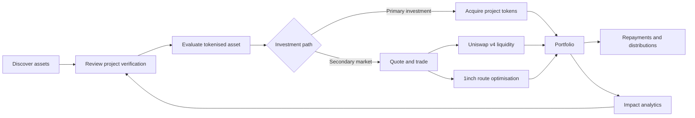

The intended demo journey is **Dashboard → Project Verification → Asset Detail → Secondary Market → Portfolio → Impact Analytics**. The screens use illustrative hackathon data; production deployments would replace that data with indexed onchain state, verified MRV feeds, market APIs, authenticated investor information, and production transaction execution.

---

### 1. Investor dashboard — `/`

**Implementation depth**

At runtime the dashboard should aggregate three independent domains:

1. **identity / eligibility state** — wallet + World ID verification result;
2. **market state** — balances, prices, liquidity, volume and recent swaps;
3. **impact state** — project metadata, MRV values and verification timestamps.

A practical API shape is:

```ts
type DashboardSnapshot = {
  account: `0x${string}`;
  chainId: 11155111 | 84532;
  worldId: {
    verified: boolean;
    action: "verify-investor";
    verifiedAt?: string;
  };
  markets: Array<{
    asset: `0x${string}`;
    symbol: string;
    priceUsd: string;
    liquidityUsd: string;
    volume24hUsd: string;
    routeSource: "uniswap-v4" | "1inch";
  }>;
  impact: {
    carbonTco2e: string;
    renewableMw: string;
    habitatHa: string;
    dataTimestamp: string;
  };
};
```

For **Sepolia / Base Sepolia**, the dashboard should read contract addresses from environment variables rather than hard-code them:

```bash
NEXT_PUBLIC_CHAIN_ID=11155111
NEXT_PUBLIC_IMPACT_ASSET_ADDRESS=0x...
NEXT_PUBLIC_IMPACT_TOKEN_ADDRESS=0x...
NEXT_PUBLIC_MARKET_ROUTER_ADDRESS=0x...
```

The same build can target Base Sepolia by switching `NEXT_PUBLIC_CHAIN_ID=84532` and using the Base deployment addresses.


<p align="center">
  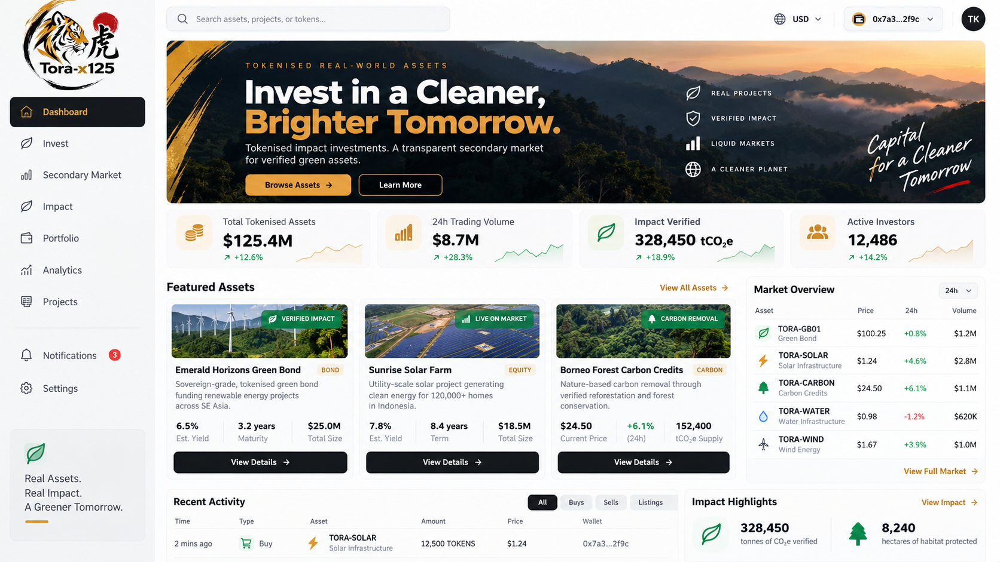
</p>

**Primary user:** Investor, portfolio manager, impact fund, family office, or institutional allocator.

**Goal:** Give the investor a fast overview of the available market before they decide what to investigate or trade. The dashboard combines financial activity with verified impact rather than treating sustainability data as a separate report.

**What the screen demonstrates**

- Market-level KPIs: total tokenised assets, 24-hour trading volume, verified impact and active investors.
- Featured assets across green bonds, renewable-energy projects and carbon-removal assets.
- Current token prices, market movement and liquidity indicators.
- Recent buy/listing activity.
- Impact highlights such as verified CO₂e and protected habitat.
- A persistent wallet connection and navigation into project verification, asset details, portfolio and secondary-market views.

**Investor workflow**

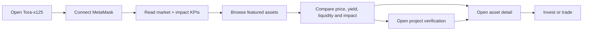

**Technology / data flow**

```text
MetaMask / EIP-1193
        |
        v
Next.js dashboard
        |
        +--> ethers.js / viem-compatible EVM reads
        +--> Ethereum / Base token balances and events
        +--> ENS-readable issuer/project identities
        +--> Indexed price / liquidity data
        +--> Verified MRV / impact data
```

The current dashboard uses demo data from the frontend data layer. In a production version, headline values and recent activity would be derived from contract events, an indexer, liquidity sources and approved project-data feeds.

**World ID / Uniswap / 1inch implementation details**

- **World ID for Agents:** the dashboard can expose fresh human-verification state alongside the connected wallet. The official event sandbox uses a confidential OIDC client; Tora-x125 starts Authorization Code + PKCE on the server, validates the callback on the server, and exposes only a hashed subject plus short-lived eligibility state to the UI.
- **Uniswap v4:** market cards can display pool-derived liquidity, volume and price data for fungible representations of project assets. The repo already provides `executeUniversalRouter(...)` in `lib/uniswap.ts`, which submits a pre-encoded Universal Router plan using `commands`, `inputs`, `deadline` and optional ETH value.
- **1inch:** dashboard price discovery can compare aggregated routes across available EVM liquidity. `lib/oneinch.ts` currently builds a v6 quote URL from `chainId`, source token, destination token, amount and optional sender. API credentials should remain server-side behind a Next.js route rather than being exposed in the browser.
- **Decision logic:** dashboard quotes should be treated as indicative. The executable route is selected only after investor eligibility, token approvals, slippage limits and chain state are revalidated at transaction time.

---

### 2. Project verification — `/projects`

**Implementation depth**

Project verification should be modelled as an auditable state machine rather than a single boolean.

```solidity
enum VerificationState {
    Draft,
    DueDiligence,
    ThirdPartyVerified,
    ApprovedForIssuance,
    Suspended
}

struct VerificationRecord {
    bytes32 documentHash;
    string metadataURI;
    uint64 verifiedAt;
    address verifier;
    VerificationState state;
}
```

A project update should emit events so the frontend/indexer can reconstruct the verification history:

```solidity
event VerificationUpdated(
    uint256 indexed projectId,
    bytes32 indexed documentHash,
    address indexed verifier,
    VerificationState state,
    string metadataURI
);
```

For a testnet demonstration, the deployment script can create the sample project immediately after contract deployment:

```ts
await asset.createProject(
  deployer.address,
  1000,
  "Tokyo Bay Solar Bond",
  "Renewable Energy",
  "Japan",
  "ipfs://tora-x125/tokyo-bay-solar.json",
  ethers.parseUnits("1000", 18),
  Math.floor(Date.now() / 1000) + 365 * 24 * 60 * 60,
  88,
  24
);
```

On Sepolia or Base Sepolia, the transaction receipt and emitted project ID become the source of truth shown in the onchain audit trail.

**World ID boundary**

World ID verifies the **investor action**, not the underlying project. A server endpoint should receive a proof, verify it using the configured World App/action, and return only an application-level result:

```ts
type EligibilityResult = {
  eligible: boolean;
  action: "verify-investor";
  expiresAt: number;
};
```

The project contract should not store World ID identity data.


<p align="center">
  
</p>

**Primary user:** Investor or due-diligence analyst evaluating whether the underlying real-world project is credible before allocating capital.

**Goal:** Make the provenance of an impact asset visible. The investor should be able to understand what was reviewed, who validated it, what impact methodology is being used, and which records have been anchored onchain.

**What the screen demonstrates**

- Project description, location, project category and token identity.
- Due-diligence checklist covering legal structure, KYC/AML, methodology review, third-party validation and token issuance approval.
- Onchain audit trail for project creation, document anchoring, audit verification, impact-data updates and token minting.
- MRV metrics such as carbon removed, forest protected, households supported and biodiversity indicators.
- Verification and compliance status.
- Links between real-world project evidence and token issuance.

**Verification workflow**

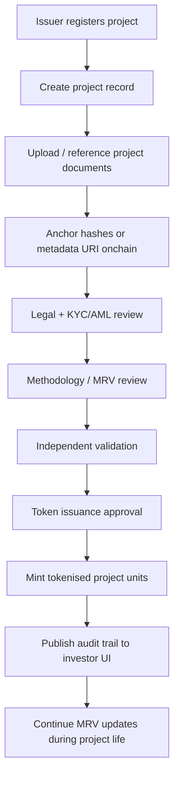

**Onchain and partner touchpoints**

- **Solidity + OpenZeppelin:** project-token and access-control logic.
- **ImpactAsset1155:** fractional project units linked to project metadata.
- **ENS:** human-readable identity for issuers and projects.
- **World ID:** privacy-preserving investor verification boundary where an eligibility proof is appropriate.
- **External validators / MRV providers:** provide signed or auditable evidence; only references/hashes need to be anchored onchain.
- **Ethereum / Base:** immutable event and metadata-reference layer.

This flow intentionally separates **verification evidence** from **financial ownership**. The token points to an auditable project record; it does not by itself prove that an impact claim is valid.

**World ID / Uniswap / 1inch implementation details**

- **World ID:** project verification and investor verification are separate. Third-party project validation answers “is this project evidence credible?”, while World ID can answer “has this investor satisfied the privacy-preserving human/eligibility check for this action?”. The intended server-side verifier should validate the proof against the configured app/action before returning an eligibility result to the frontend.
- **World ID gating:** once verified, Tora-x125 can issue a short-lived server session or an application-level eligibility flag used before allowing restricted actions such as investing, trading, or claiming certain distributions. The World ID proof itself does not need to be embedded in `ImpactAsset1155`.
- **Uniswap v4:** verified project status can later feed into hook-controlled market rules—for example, allowing a pool or trading path only when an asset is active, verified, or within a defined risk state. The current repo documents this as an architectural extension; the production hook contract is not yet implemented.
- **1inch:** project verification data is not passed to 1inch. Instead, Tora-x125 performs eligibility and asset-status checks first, then requests routing/quote information only for assets that are permitted to trade.
- **Separation of concerns:** World ID handles investor verification, project/MRV systems handle asset verification, Uniswap v4 handles programmable liquidity, and 1inch handles route optimisation.

---

### 3. Impact analytics — `/impact`

**Implementation depth**

Impact analytics should preserve provenance for every metric instead of storing only a final number.

```ts
type ImpactObservation = {
  projectId: bigint;
  metric: "tCO2e" | "MWh" | "hectares" | "households";
  value: string;
  periodStart: string;
  periodEnd: string;
  methodology: string;
  sourceURI: string;
  sourceHash: `0x${string}`;
  verifier: `0x${string}`;
  verifiedAt: string;
};
```

A production indexer would join:

```text
ImpactAsset1155 balances
        +
project metadata / MRV observations
        +
RepaymentVault events
        +
Uniswap v4 swap/pool events
        +
1inch route observations
        =
portfolio financial + impact analytics
```

For testnet use, market analytics can be populated from Sepolia/Base Sepolia transactions while impact metrics remain demo or manually anchored records. The README and UI should continue to label which values are **onchain testnet data** and which are **illustrative MRV data**.

**Uniswap / 1inch separation**

- Uniswap v4 pool events provide executed market activity.
- 1inch responses provide route/quote observations.
- MRV feeds provide impact data.
- World ID contributes eligibility state only.

Those streams should remain separate in the analytics schema.


<p align="center">
  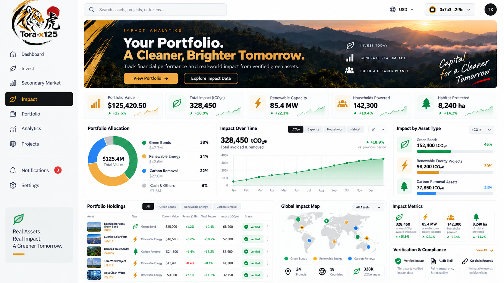
</p>

**Primary user:** Investor, ESG/impact team, fund manager, issuer, or reporting stakeholder.

**Goal:** Show financial performance and real-world outcomes in the same portfolio view, so an investor can answer both “How is my investment performing?” and “What measurable impact is associated with my holdings?”

**What the screen demonstrates**

- Portfolio value and aggregate verified impact.
- Renewable-energy capacity, households powered and habitat protected.
- Portfolio allocation by impact-asset type.
- Impact-over-time visualisation.
- Asset-level impact attribution.
- Geographic coverage across projects and countries.
- Verification/compliance status for reported impact.

**Impact-data workflow**

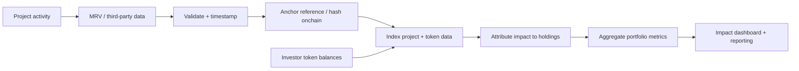

**Example metrics**

| Category | Example display | Data concept |
| --- | --- | --- |
| Carbon | 328,450 tCO₂e | Avoided or removed emissions |
| Renewable energy | 85.4 MW | Installed / attributable capacity |
| Social | 142,300 households | Beneficiary or access metric |
| Nature | 8,240 ha | Habitat or forest protected |

In production, Tora-x125 would preserve the source, methodology, reporting period and verification status for each metric so that portfolio aggregation does not erase the underlying evidence.

**World ID / Uniswap / 1inch implementation details**

- **World ID:** impact analytics should not expose or infer personal identity from verification. The analytics layer only needs an application-level “verified/eligible” state when gating personalised portfolio views or investor-only reporting.
- **Uniswap v4:** pool events can contribute market-side analytics such as realised swap volume, liquidity depth, fees, price movement and pool utilisation. These should be indexed from the target Ethereum/Base deployment and displayed separately from environmental impact metrics.
- **1inch:** quote/routing responses can be used to estimate executable portfolio conversion paths and slippage for impact assets. For analytics, these are best treated as point-in-time routing observations rather than canonical market prices.
- **Attribution model:** environmental impact should be sourced from MRV/project data, while market performance should be sourced from token balances, repayment contracts, Uniswap pool events and routing/quote data. Keeping those sources separate avoids mixing “impact verified” with “market liquid”.

---

### 4. Portfolio management — `/portfolio`

**Implementation depth**

Portfolio state should be rebuilt from chain state rather than persisted as a mutable frontend total.

```ts
const projectBalance = await impactAsset.balanceOf(account, projectId);
const settlementBalance = await impactToken.balanceOf(account);
const claimable = await repaymentVault.claimable(projectId, account);
```

A rebalancing request can use 1inch for route discovery while keeping Uniswap v4 as the preferred programmable pool when the direct route is competitive:

```text
Current holdings
   ↓
Target weights
   ↓
Generate required token deltas
   ↓
Fetch 1inch quote(s)
   ↓
Read direct Uniswap v4 pool state
   ↓
Compare expected output + gas + slippage
   ↓
World ID / eligibility re-check
   ↓
Permit2 / approval
   ↓
Execute route
   ↓
Wait for receipt
   ↓
Refresh balances + claimable repayments
```

**Illustrative 1inch server-side quote request**

```ts
const url = buildOneInchQuoteUrl({
  chainId,
  src: sourceToken,
  dst: destinationToken,
  amount: amountInBaseUnits,
  from: account
});

const response = await fetch(url, {
  headers: {
    Authorization: `Bearer ${process.env.ONEINCH_API_KEY}`
  }
});
```

The API key belongs only in the server environment. The browser receives a sanitised quote object, not the credential.

**Testnet note**

1inch support differs by chain/network and asset. For a Sepolia/Base Sepolia demo, the app can still exercise its own Uniswap v4 test pool directly even when a 1inch route is unavailable, while keeping the 1inch integration enabled for supported environments.


<p align="center">
  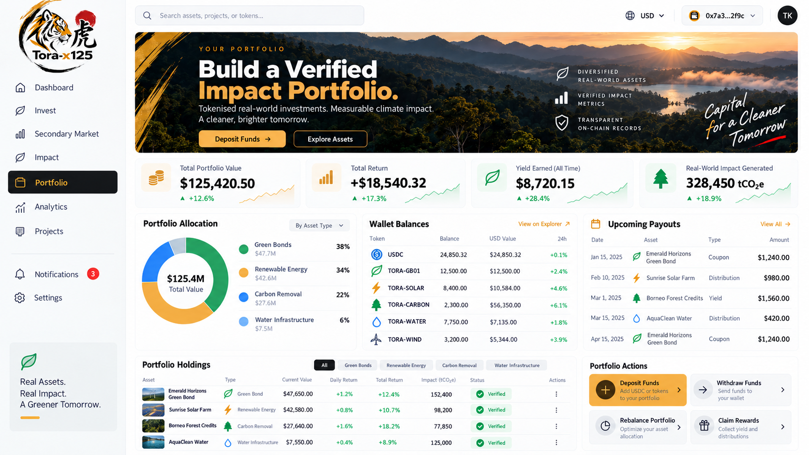
</p>

**Primary user:** Token holder managing several impact assets and stablecoin balances.

**Goal:** Provide one place to understand positions, returns, cash flows and impact exposure after the investor has acquired tokenised assets.

**What the screen demonstrates**

- Total portfolio value, return, yield earned and real-world impact generated.
- Allocation across green bonds, renewable energy, carbon removal and infrastructure.
- Wallet balances for USDC and project tokens.
- Upcoming coupons, yields and project distributions.
- Verified portfolio holdings.
- Deposit, withdrawal, rebalancing and reward/repayment actions.

**Portfolio workflow**

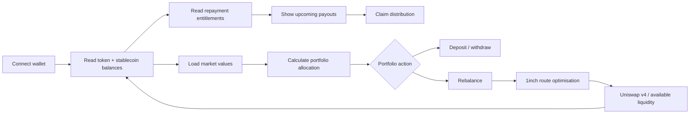

**Smart-contract mapping**

- **ImpactAsset1155:** investor project-unit balances.
- **ImpactToken / stablecoin settlement:** quote-side and settlement assets for the MVP.
- **RepaymentVault:** programmable distributions based on token holdings.
- **Ethereum / Base explorer links:** transaction and token-history traceability.
- **1inch:** intended route optimisation for portfolio rebalancing.
- **Uniswap v4:** intended programmable liquidity for supported market pairs.

A production distribution model should use appropriate record-date/snapshot mechanics rather than assuming the current token balance always represents historical entitlement.

**World ID / Uniswap / 1inch implementation details**

- **World ID:** sensitive portfolio actions can require a fresh verification result before execution. A typical flow is `Connect wallet → World ID proof → server verification → eligibility session → enable action`. The app should bind the verified action to the intended purpose and avoid reusing one proof indiscriminately across unrelated actions.
- **1inch rebalancing:** when an investor requests a rebalance, the server can request 1inch quotes for candidate source/destination pairs, compare expected output, gas and slippage, and return a route preview to the client.
- **Uniswap v4 execution:** if the chosen path uses the Tora-x125 v4 pool, the frontend prepares or receives encoded Universal Router commands. `executeUniversalRouter` then submits the plan with the connected signer.
- **Approvals:** ERC-20 settlement assets may require Permit2/token approvals before the Universal Router can spend them. Approval state should be checked before execution and the UI should clearly separate “approve” from “swap”.
- **Post-trade refresh:** after confirmation, token balances, repayment entitlements, portfolio weights and impact attribution are re-read from the relevant contracts/indexer.

---

### 5. Tokenised asset detail — `/assets/emerald-horizons`

**Implementation depth**

The asset page is the transaction-orchestration layer. Before enabling **Buy** or **Sell**, it should perform:

```text
1. Check connected wallet
2. Check expected chain ID
3. Load deployed contract addresses
4. Load project + token metadata
5. Load World ID eligibility/session
6. Read token balance / allowance
7. Fetch direct Uniswap v4 pool quote
8. Fetch 1inch quote when supported
9. Apply slippage + deadline policy
10. Construct approval / Permit2 transaction if needed
11. Construct swap transaction
12. Present exact token amounts and contracts to user
13. Sign in MetaMask
14. Wait for receipt and refresh state
```

**World ID server verification skeleton**

The exact World ID SDK/API call is version-specific, but the application boundary should look like this:

```ts
// app/api/world-id/verify/route.ts
export async function POST(req: Request) {
  const proof = await req.json();

  // Verify proof server-side against:
  // - configured World App / app ID
  // - action: "verify-investor"
  // - expected verification level / policy
  const result = await verifyWorldIdProofServerSide(proof);

  if (!result.success) {
    return Response.json({ eligible: false }, { status: 403 });
  }

  return Response.json({
    eligible: true,
    action: "verify-investor",
    expiresAt: Date.now() + 15 * 60 * 1000
  });
}
```

**Uniswap v4 transaction boundary**

The repository currently accepts an already encoded Universal Router plan:

```ts
await executeUniversalRouter(
  signer,
  routerAddress,
  commands,
  inputs,
  deadline,
  value
);
```

The production encoder should use the official Uniswap v4 SDK/contracts for the deployed testnet version and derive:

- PoolKey / currency pair
- fee
- tick spacing
- hook address
- exact-input or exact-output swap parameters
- minimum output
- Permit2 actions
- deadline

**Testnet example**

After deploying `ImpactToken` and the fungible representation of a project asset to Sepolia/Base Sepolia:

```bash
npm run deploy:sepolia
npm run deploy:base-sepolia
npm run deploy:uniswap-hook:sepolia
npm run deploy:uniswap-hook:base-sepolia
```

the asset page can be pointed at those addresses via `.env.local`. Any pool/router address shown to the user should be the actual testnet deployment address, never an assumed production address.


<p align="center">
  
</p>

**Primary user:** Investor making a decision on a specific tokenised impact investment.

**Goal:** Bring the information needed to assess and transact in a single asset into one page: financial terms, token supply, issuer identity, project impact, verification status, repayment logic and market access.

**What the screen demonstrates**

- Token price, estimated yield, maturity, total issuance and remaining supply.
- Issuer and project classification.
- Asset price history.
- Buy/sell interaction.
- Renewable-energy, carbon, nature and social impact metrics.
- Project overview and use of proceeds.
- Coupon / repayment terms.
- Token standard, market status and investor-verification requirement.

**Asset-investment workflow**

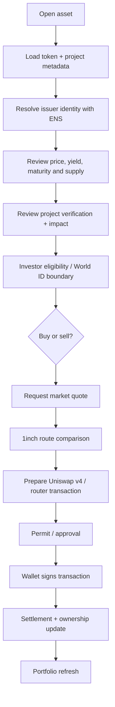

**Implementation boundary**

The current page demonstrates the interaction and data model. Production execution still requires live pool configuration, Permit2/approval handling, Uniswap v4 command encoding, authenticated 1inch access where used, and appropriate investor/transfer restrictions.

For market liquidity, ERC-1155 project units may require a defined fungible representation or wrapper depending on the chosen pool design.

**World ID / Uniswap / 1inch implementation details**

1. **Eligibility check with World ID**
   - Client loads `appId` and `action` using `getWorldIdConfig()`.
   - Investor generates a World ID proof for the configured action.
   - Proof is sent to a protected server route for verification.
   - The server returns an eligibility result used to unlock the buy/sell flow.
   - No personal identity record is written into the project-token contract.

2. **Quote discovery with 1inch**
   - Tora-x125 converts the entered amount into base units.
   - The server constructs a v6 quote request using `chainId`, `src`, `dst`, `amount`, and optionally the investor address.
   - `buildOneInchQuoteUrl()` provides the current adapter boundary.
   - The server adds the required 1inch authentication header, fetches the quote, validates token addresses/chain, and returns a sanitised quote to the client.
   - Quotes are refreshed before execution because prices and routes can change between preview and signature.

3. **Execution with Uniswap v4**
   - Tora-x125 identifies the v4 pool and fungible token representation for the impact asset.
   - The official Uniswap v4 SDK/contracts are used to encode the `V4_SWAP` actions and any Permit2 commands required by the Universal Router.
   - The encoded `commands`, `inputs`, and `deadline` are passed into `executeUniversalRouter()`.
   - MetaMask signs and broadcasts the transaction on Ethereum or Base.
   - After confirmation, the UI updates ownership, settlement balance, price and portfolio state.

4. **Safety checks before signature**
   - correct chain ID
   - supported token addresses
   - World ID eligibility state where required
   - allowance / Permit2 status
   - quote expiry / deadline
   - minimum output and maximum slippage
   - current project active/verified status
   - expected router and pool addresses

---

### 6. Secondary market — `/market`

**Implementation depth**

The secondary market should separate **quote generation**, **policy checks**, and **execution**.

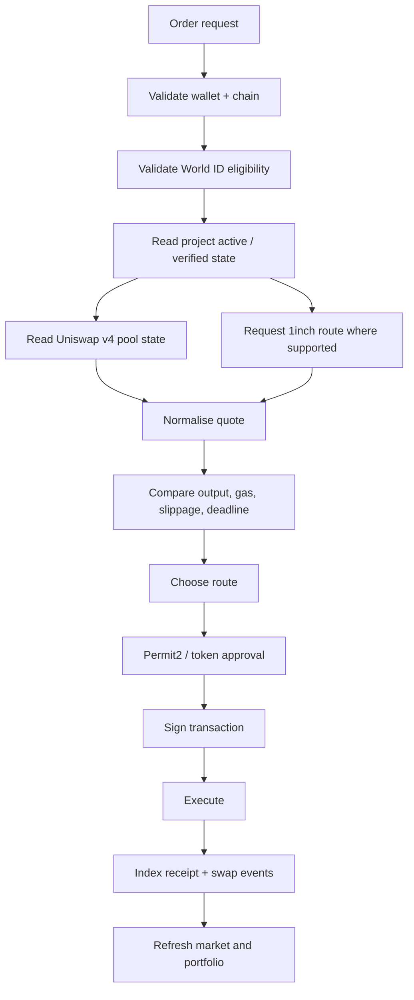

**Uniswap v4 testnet deployment pattern**

A complete v4 demo requires more than deploying the Tora contracts. The integration also needs access to the v4 deployment components for the target network:

```text
PoolManager
Universal Router
Permit2
PositionManager / liquidity provisioning path
optional Tora hook
project asset ERC-20 or fungible wrapper
settlement token
initial liquidity
```

Network addresses should be stored in configuration:

```ts
type MarketDeployment = {
  chainId: number;
  poolManager: `0x${string}`;
  universalRouter: `0x${string}`;
  permit2: `0x${string}`;
  hook?: `0x${string}`;
  projectToken: `0x${string}`;
  settlementToken: `0x${string}`;
};
```

A deployment registry is preferable to scattered environment variables once multiple assets are live.

**Optional v4 hook design**

A Tora-specific hook could enforce market-state logic such as:

```solidity
function beforeSwap(...) external returns (...) {
    require(projectRegistry.isActive(projectId), "PROJECT_INACTIVE");
    require(riskRegistry.riskScore(projectId) <= maxRiskScore, "RISK_LIMIT");
    // additional pool-specific policy
}
```

This is only one control layer. Legally required transfer restrictions should also exist in the asset/transfer architecture rather than depend only on a liquidity hook.

**1inch route comparison**

Tora-x125 can normalise both direct-v4 and aggregated quotes:

```ts
type ExecutableQuote = {
  source: "uniswap-v4" | "1inch";
  amountIn: bigint;
  expectedAmountOut: bigint;
  minAmountOut: bigint;
  estimatedGas: bigint;
  expiresAt: number;
  transaction?: {
    to: `0x${string}`;
    data: `0x${string}`;
    value: bigint;
  };
};
```

Before presenting a 1inch-generated transaction, the server should validate:

- chain ID
- source/destination token addresses
- recipient
- destination contract
- input amount
- minimum output / slippage policy
- quote age
- project eligibility state

**World ID trade gating**

World ID should be checked before quote execution, and optionally rechecked when the eligibility session expires:

```text
World ID proof
    ↓
server verification
    ↓
short-lived eligibility session
    ↓
quote request
    ↓
transaction construction
    ↓
wallet signature
```

For a regulated RWA deployment, this is only one element of the compliance decision and does not replace KYC/AML, accreditation, jurisdictional or transfer-rule controls.

**Concrete Sepolia / Base Sepolia demo sequence**

```bash
# 1. deploy Tora contracts
npm run deploy:sepolia
npm run deploy:base-sepolia

# 2. record addresses in environment / deployment registry
# 3. configure v4 PoolManager / Router / Permit2 for each chain
# 4. deploy or configure fungible project-token representation
# 5. initialise pool and seed test liquidity
# 6. configure World ID app/action for the frontend + verifier
# 7. configure 1inch API key on the server
# 8. run Next.js against the selected testnet
npm run dev
```

Current repository status: contract deployment is configured for both testnets, but the latest GitHub Actions deployment stopped before broadcasting because `DEPLOYER_PRIVATE_KEY` has not yet been configured as a repository secret. The README therefore does not claim live contract or liquidity-pool addresses yet.


<p align="center">
  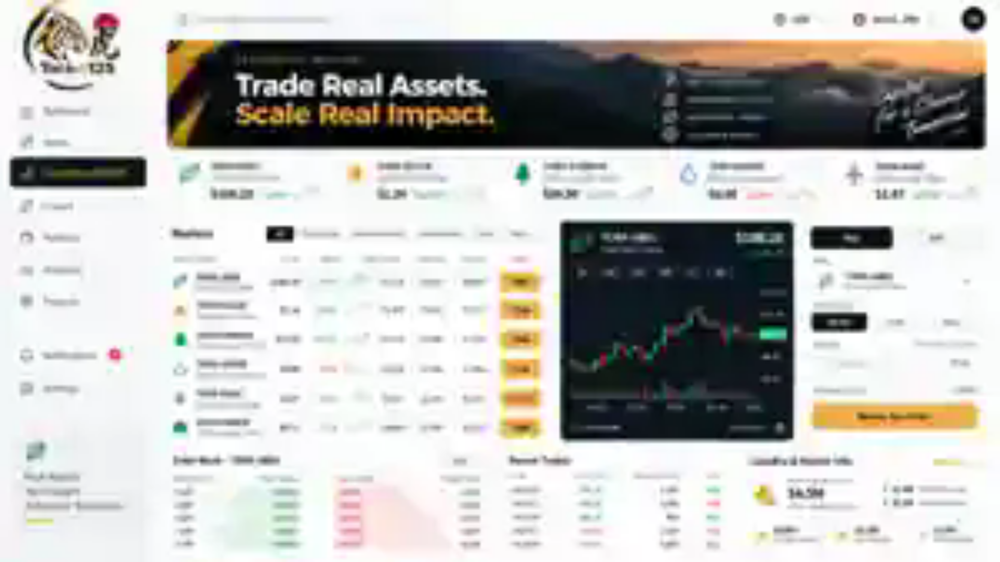
</p>

**Primary user:** Investor seeking liquidity before an impact investment reaches maturity.

**Goal:** Turn normally illiquid green investments into discoverable, priceable and tradable digital assets while keeping the underlying project and impact information attached to the investment experience.

**What the screen demonstrates**

- Multi-asset ticker for green bonds, solar projects, carbon credits, water infrastructure and wind assets.
- Market price, daily movement, volume and liquidity.
- Buy/sell order entry.
- Market-depth / order-book visualisation and recent trades.
- AMM liquidity metrics such as pool liquidity and spread.
- Stablecoin-denominated settlement.
- A unified route from market discovery to transaction execution.

**EVM secondary-market workflow**

```mermaid
flowchart LR
    A[Select tokenised asset] --> B[Enter buy / sell amount]
    B --> C[Check investor eligibility]
    C --> D[Fetch liquidity + quote]
    D --> E[1inch evaluates routes]
    D --> F[Uniswap v4 pool state]
    F --> G[v4 hook / trading rules]
    E --> H[Choose execution path]
    G --> H
    H --> I[Permit2 / token approval]
    I --> J[MetaMask signs]
    J --> K[Swap executes on Ethereum / Base]
    K --> L[Stablecoin / token settlement]
    L --> M[Events indexed]
    M --> N[Market + portfolio UI refresh]
```

**How the liquidity components fit together**

- **Uniswap v4:** primary programmable AMM layer. Hooks can support future asset-specific rules or market logic.
- **1inch:** routing layer for finding efficient paths and stablecoin settlement across available EVM liquidity.
- **MetaMask + ethers.js:** wallet signing and transaction submission.
- **Ethereum / Base:** settlement networks.
- **ENS:** readable identities for projects, issuers or counterparties where useful.
- **World ID:** privacy-preserving verification boundary before restricted investor actions.

The visible order book is an **illustrative market-depth UI** in the EVM prototype; Uniswap v4 itself is AMM-based rather than a central-limit order book. The separately explored Sui design could use **DeepBook** for a native onchain order-book implementation.

**Detailed trade implementation**

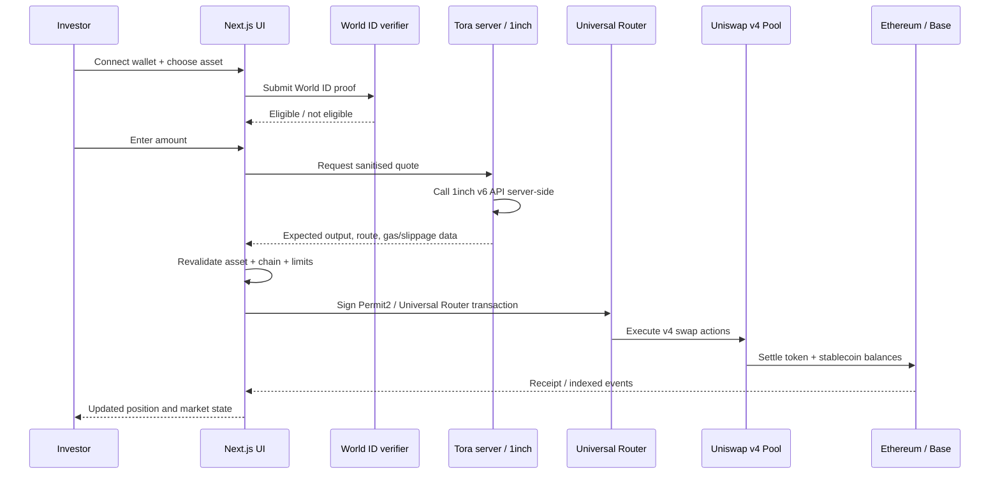

**Uniswap v4 implementation**

- **Custom hook implemented:** `contracts/uniswap/ToraImpactHook.sol` imports the official `@uniswap/v4-core` interfaces/types and implements the `beforeSwap` lifecycle callback.
- **Pool policy:** the hook stores per-`PoolId` liveness, maximum absolute swap amount, and a project-verification hash. Suspended markets or oversized swaps revert before v4 swap execution.
- **Correct callback bits:** `scripts/deploy-uniswap-hook.ts` mines a CREATE2 salt so the hook address exposes the **BEFORE_SWAP** permission bit and no other hook permissions. The constructor uses `Hooks.validateHookPermissions`.
- **Tested failure paths:** Hardhat tests prove active-market execution, oversized-swap rejection, disabled-market rejection, and rejection of non-PoolManager callers.
- **Official testnet configuration:** Sepolia and Base Sepolia PoolManager values are configured from Uniswap's official Universal Router deployment parameters.
- **Router execution:** `lib/uniswap.ts` retains Universal Router execution via `router.execute(commands, inputs, deadline)` and includes Permit2/testnet metadata.
- **Asset representation:** a conventional v4 pool still requires a fungible ERC-20 representation; raw ERC-1155 project units need a wrapper or an alternative market design.
- **Compliance boundary:** hook policy is a market-control layer, not the sole identity/transfer-compliance mechanism.

**1inch implementation path**

- 1inch calls should originate from a server route so the API key is not shipped to the browser.
- The quote request should be chain-specific and use canonical token addresses and integer base-unit amounts.
- Tora-x125 can compare a 1inch aggregated quote with the direct Tora v4 pool route and expose the expected output, price impact/slippage, and estimated gas before the investor signs.
- A quote is not a settlement guarantee; the app must apply minimum-output protection and refresh stale quotes.
- Where 1inch returns transaction data for an executable route, Tora-x125 should validate the destination contract, chain, calldata metadata and token pair before presenting it to the signer.

**World ID implementation path**

- World ID is used before restricted investment/trading actions, not as a substitute for securities KYC/AML or jurisdictional compliance.
- The client obtains a proof for the configured `appId` and action.
- The proof is verified server-side and converted into an application-level eligibility/session result.
- The app can use the nullifier/action semantics to prevent inappropriate proof reuse without storing identity data onchain.
- If a trade requires stronger regulatory checks, World ID becomes one input into the eligibility decision rather than the sole compliance mechanism.

---

### Shared technical implementation across all six use cases

#### Environment model

```bash
# Chain / deployment
NEXT_PUBLIC_CHAIN_ID=11155111
NEXT_PUBLIC_IMPACT_ASSET_ADDRESS=0x...
NEXT_PUBLIC_IMPACT_TOKEN_ADDRESS=0x...
NEXT_PUBLIC_MARKET_ROUTER_ADDRESS=0x...

# World ID for Agents - official event sandbox (server-only confidential client)
WORLD_ID_ISSUER=https://sandbox.auth.world.org
WORLD_ID_CLIENT_ID=...
WORLD_ID_CLIENT_SECRET=...
WORLD_ID_REDIRECT_URI=https://YOUR_PUBLIC_HTTPS_HOST/api/world/callback
WORLD_ID_SESSION_SECRET=...
WORLD_ID_SESSION_TTL_SECONDS=300

# Server-only
ONEINCH_API_KEY=...
SEPOLIA_RPC_URL=https://...
BASE_SEPOLIA_RPC_URL=https://...
DEPLOYER_PRIVATE_KEY=0x...
```

`DEPLOYER_PRIVATE_KEY`, `ONEINCH_API_KEY`, `WORLD_ID_CLIENT_SECRET`, and `WORLD_ID_SESSION_SECRET` must never be exposed through `NEXT_PUBLIC_*` variables.

#### Network-aware configuration

```ts
const deployments = {
  11155111: {
    name: "Ethereum Sepolia",
    impactAsset: process.env.NEXT_PUBLIC_IMPACT_ASSET_ADDRESS,
    impactToken: process.env.NEXT_PUBLIC_IMPACT_TOKEN_ADDRESS
  },
  84532: {
    name: "Base Sepolia",
    impactAsset: process.env.NEXT_PUBLIC_BASE_IMPACT_ASSET_ADDRESS,
    impactToken: process.env.NEXT_PUBLIC_BASE_IMPACT_TOKEN_ADDRESS
  }
} as const;
```

The application should refuse to transact if the connected wallet chain is not one of the configured deployments.

#### Recommended server-side routes

```text
POST /api/world/start
    create PKCE/state/nonce request bound to one trade and return sandbox authorize URL

GET /api/world/callback
    server-side code exchange + JWKS/issuer/audience/nonce/auth_time validation

GET /api/world/status
    expose only non-sensitive validated session status

POST /api/world/protected-action
    issue a short-lived trade authorization only after validated World identity

POST /api/world/reset
    clear the verification session for the denied-path demo

GET /api/quote?chainId=&src=&dst=&amount=
    call 1inch server-side where supported
    read direct Uniswap v4 route
    normalise and compare quotes

POST /api/prepare-swap
    revalidate chain, asset status, eligibility and slippage
    return encoded execution data

GET /api/projects/:id
    merge indexed onchain state + verified metadata/MRV references
```

#### Testnet deployment lifecycle

```mermaid
flowchart LR
    A[Compile + tests] --> B[Deploy ImpactToken]
    B --> C[Deploy ImpactAsset1155]
    C --> D[Deploy RepaymentVault]
    D --> E[Create sample project]
    E --> F[Record addresses]
    F --> G[Configure World ID]
    G --> H[Configure v4 contracts / pool]
    H --> I[Seed test liquidity]
    I --> J[Configure 1inch server API]
    J --> K[Run end-to-end transaction]
    K --> L[Add explorer links + tx hashes to README]
```

A deployment should be considered complete only after the application can demonstrate an end-to-end transaction with explorer-verifiable receipts, not merely after the three Tora contracts have been deployed.

---

### How the six use cases connect

```text
1. Dashboard
   Discover an opportunity
        |
        v
2. Project Verification
   Establish project trust and provenance
        |
        v
5. Asset Detail
   Evaluate financial terms + impact + token structure
        |
        v
6. Secondary Market
   Buy / sell through programmable liquidity
        |
        v
4. Portfolio
   Hold, monitor, rebalance and receive distributions
        |
        v
3. Impact Analytics
   Measure financial + real-world outcomes
        |
        +---------------------> feedback into future investment decisions
```

### Demo-data and production boundary

The screenshots and frontend currently use illustrative project, price, liquidity, return and impact values designed to explain the product. They should not be interpreted as live investment data or verified real-world claims.

A production implementation would additionally require live contract indexing, audited smart contracts, production Uniswap v4 pools/hooks, secured 1inch integration, identity/eligibility controls where legally required, verified oracle/MRV sources, robust repayment snapshots, project-document storage, and jurisdiction-specific compliance controls.

## Smart contracts

### ImpactAsset1155.sol

Each verified impact project is represented by an ERC-1155 token ID. Units can represent fractional ownership or economic exposure to an underlying impact investment.

Linked project data includes:

- project name and type
- location
- metadata URI
- face value
- maturity
- impact score
- risk score
- active status

### ImpactToken.sol

ERC-20 demo settlement token (`TID`) representing quote-side liquidity for the MVP.

### RepaymentVault.sol

Allows a project operator to fund per-unit repayments. Token holders can claim distributions based on their ERC-1155 holdings.

## Secondary liquidity

### Uniswap v4

Uniswap v4 is the programmable liquidity layer. Tora-x125 now contains a concrete v4 extension rather than only an integration boundary:

- `ToraImpactHook.sol` implements a **BEFORE_SWAP** policy hook using the official `@uniswap/v4-core` package.
- per-pool policy can pause/resume a market, cap absolute swap size, and anchor a project-verification hash;
- `HookCreate2Factory.sol` + `deploy-uniswap-hook.ts` deploy the hook at an address with the correct v4 permission bits;
- `test/ToraImpactHook.js` exercises both allowed and fail-closed policy paths;
- `lib/uniswap.ts` provides Sepolia/Base Sepolia PoolManager + Permit2 configuration and Universal Router transaction execution.

The hook deliberately returns zero swap delta: when policy passes, ordinary Uniswap v4 AMM math remains responsible for pricing and settlement.

### 1inch

The 1inch adapter provides a routing boundary for finding efficient swap paths and stablecoin settlement across available EVM liquidity.

For the hackathon MVP, 1inch and Uniswap v4 are complementary:

- **Uniswap v4** — primary programmable liquidity and hook logic
- **1inch** — route optimisation across available swap liquidity

## Identity and verification

### ENS

ENS is used as the readable identity layer for issuers, projects and counterparties. The frontend helper resolves ENS names through the connected EVM provider.

### World ID for Agents

Tora-x125 integrates the **official ETHGlobal event development environment** at `https://sandbox.auth.world.org` as a confidential OIDC client. The integration uses Authorization Code + PKCE, a fresh authentication request, backend-only token exchange and JWKS validation before the application grants a protected Trade Agent action.

**Complete judge journey**

```text
Investor defines a trade
      ↓
POST /api/world/start
      ↓
PKCE + state + nonce + immutable trade binding
      ↓
Official World ID for Agents sandbox
      ↓
User completes / cancels authentication
      ↓
GET /api/world/callback
      ↓
Backend code exchange + signed ID-token validation
      ↓
HttpOnly short-lived verified session
      ↓
POST /api/world/protected-action
      ↓
2-minute Trade Agent authorization
      ↓
1inch / Uniswap v4 route comparison → wallet signature
```

**Failure journey**

A cancelled World request, expired request, invalid state/nonce/token, expired verified session, or direct call without a validated session returns a denied result. The protected route returns HTTP `403` with `actionExecuted=false`; no trade authorization is produced. The dedicated **`/world-agents`** screen includes a **Test denied path** button that clears the verified session and proves this fail-closed behavior.

**Security boundary**

The client secret and session-signing secret exist only in server environment variables. The browser never exchanges the authorization code with World and never treats an unvalidated callback as authorization. The backend validates the World signature through the sandbox JWKS plus issuer, audience, expiry, state, nonce and authentication freshness before creating an HttpOnly signed session. Raw World `sub` is not exposed to the client or written onchain.

**Code for judges**

- `lib/worldid-server.ts` — official sandbox discovery, PKCE, secure code exchange, ID-token/JWKS validation and signed sessions.
- `app/api/world/start/route.ts` — creates the fresh verification request.
- `app/api/world/callback/route.ts` — handles success, denied, cancelled and expired outcomes.
- `app/api/world/protected-action/route.ts` — fail-closed protected Trade Agent action.
- `components/WorldAgentGate.tsx` + `app/world-agents/page.tsx` — complete interactive success/failure demo.
- `docs/world-id-agents-debrief.md` — integration feedback and live-demo checklist.

**Live event configuration**

Register a confidential sandbox OIDC client and use the exact public HTTPS callback `https://YOUR_HOST/api/world/callback`. Then configure `WORLD_ID_CLIENT_ID`, `WORLD_ID_CLIENT_SECRET`, `WORLD_ID_REDIRECT_URI`, and a random `WORLD_ID_SESSION_SECRET` on the backend. The official event sandbox does not use the old public `NEXT_PUBLIC_WORLD_ID_APP_ID` flow for this Agents integration.

## Networks

The core EVM implementation is designed for:

- **Ethereum** — primary smart-contract and liquidity ecosystem
- **Base** — low-cost EVM execution and secondary-market deployment

Testnet configuration is provided for:

- Ethereum Sepolia
- Base Sepolia

## Explored Sui architecture

We also explored an alternative implementation using:

- **Move** for asset and market logic
- **zkLogin** for wallet onboarding
- **DeepBook** for high-performance onchain order-book liquidity

This is an explored architecture rather than the primary implementation in this repository.

## Local setup

### Requirements

- Node.js 20+
- npm
- MetaMask or another EIP-1193-compatible wallet

### Install

```bash
npm install
```

### Run the dashboard

```bash
npm run dev
```

Open `http://localhost:3000`.

### Compile contracts

```bash
npm run contracts:compile
```

### Run contract tests

```bash
npm run contracts:test
```

### Build the frontend

```bash
npm run build
```

## Testnet deployments

Tora-x125 is configured for deployment to two EVM testnets:

| Network | Chain ID | Purpose | Status |
| --- | ---: | --- | --- |
| Ethereum Sepolia | 11155111 | Primary Ethereum test deployment | **Pending deployment** |
| Base Sepolia | 84532 | Low-cost EVM secondary-market deployment | **Pending deployment** |

The repository includes a GitHub Actions deployment workflow at `.github/workflows/deploy-testnets.yml`. It compiles the contracts, checks for a deployment key, deploys to both testnets, and uploads the deployment logs as a workflow artifact.

### Current deployment status

A deployment run was triggered from GitHub Actions. Contract installation and compilation completed successfully, but the deployment stopped before any transaction was broadcast because the repository does not currently have a `DEPLOYER_PRIVATE_KEY` Actions secret configured.

No contract addresses are listed here until an onchain deployment succeeds.

### Required GitHub Actions secrets

Configure the following under **GitHub repository → Settings → Secrets and variables → Actions**:

| Secret | Required | Description |
| --- | --- | --- |
| `DEPLOYER_PRIVATE_KEY` | Yes | Private key for a dedicated testnet deployment wallet. Do not commit this value to the repository. |
| `SEPOLIA_RPC_URL` | Optional | Ethereum Sepolia RPC endpoint. The workflow can fall back to a public endpoint. |
| `BASE_SEPOLIA_RPC_URL` | Optional | Base Sepolia RPC endpoint. The workflow can fall back to the public Base Sepolia RPC. |

The deployment wallet must hold enough **testnet ETH** on both networks to pay gas.

### Contracts deployed on each network

The deployment script deploys the same contract set to Ethereum Sepolia and Base Sepolia:

1. `ImpactToken` — ERC-20 demo settlement / quote token.
2. `ImpactAsset1155` — ERC-1155 project-unit tokenisation contract.
3. `RepaymentVault` — programmable repayment/distribution contract.
4. A sample project — **Tokyo Bay Solar Bond** — is created after deployment.

### Deployment commands

Local deployment uses the same Hardhat configuration as CI:

```bash
npm run deploy:sepolia
npm run deploy:base-sepolia
```

Required environment variables:

```bash
DEPLOYER_PRIVATE_KEY=0x...
SEPOLIA_RPC_URL=https://...
BASE_SEPOLIA_RPC_URL=https://...

# Optional override; otherwise official Sepolia/Base Sepolia PoolManager defaults are used
UNISWAP_V4_POOL_MANAGER_ADDRESS=0x...
```

### GitHub Actions deployment workflow

The workflow performs:

```text
Checkout repository
      ↓
Install dependencies
      ↓
Compile Solidity contracts
      ↓
Check DEPLOYER_PRIVATE_KEY secret
      ↓
Deploy ImpactToken
      ↓
Deploy ImpactAsset1155
      ↓
Deploy RepaymentVault
      ↓
Create sample project
      ↓
Repeat on Base Sepolia
      ↓
Upload deployment logs
```

After a successful deployment, this section should be updated with the deployed addresses and explorer links in the following format:

| Network | Contract | Address | Explorer |
| --- | --- | --- | --- |
| Ethereum Sepolia | ImpactToken | `0x...` | `https://sepolia.etherscan.io/address/0x...` |
| Ethereum Sepolia | ImpactAsset1155 | `0x...` | `https://sepolia.etherscan.io/address/0x...` |
| Ethereum Sepolia | RepaymentVault | `0x...` | `https://sepolia.etherscan.io/address/0x...` |
| Base Sepolia | ImpactToken | `0x...` | `https://sepolia.basescan.org/address/0x...` |
| Base Sepolia | ImpactAsset1155 | `0x...` | `https://sepolia.basescan.org/address/0x...` |
| Base Sepolia | RepaymentVault | `0x...` | `https://sepolia.basescan.org/address/0x...` |

### Frontend configuration after deployment

Copy the deployed addresses into `.env.local`:

```bash
NEXT_PUBLIC_IMPACT_ASSET_ADDRESS=0x...
NEXT_PUBLIC_IMPACT_TOKEN_ADDRESS=0x...
NEXT_PUBLIC_MARKET_ROUTER_ADDRESS=0x...
NEXT_PUBLIC_CHAIN_ID=11155111
```

For Base Sepolia, switch `NEXT_PUBLIC_CHAIN_ID` to `84532` and use the Base deployment addresses.

## Demo flow

1. Connect MetaMask.
2. Browse verified tokenised impact investments.
3. Inspect project, financial, impact, risk and repayment information.
4. Resolve readable issuer/project identity through ENS.
5. Verify investor eligibility through the World ID integration boundary.
6. Preview programmable liquidity through Uniswap v4.
7. Use the 1inch adapter for optimised routing / settlement.
8. Deploy the same EVM contracts to Ethereum Sepolia or Base Sepolia.

## MVP scope

Tora-x125 is a hackathon MVP demonstrating the architecture for a secondary market in verified, tokenised impact investments.

Before production use, add audited transfer restrictions, regulatory/eligibility controls, production Uniswap v4 hook logic, production 1inch API execution, server-side World ID proof verification, verified impact-data oracles, indexing, robust repayment snapshots and a smart-contract security review.

## Commands

```bash
npm run dev
npm run build
npm run contracts:compile
npm run contracts:test
npm run deploy:sepolia
npm run deploy:base-sepolia
```

## License

MIT. See [LICENSE](LICENSE).
